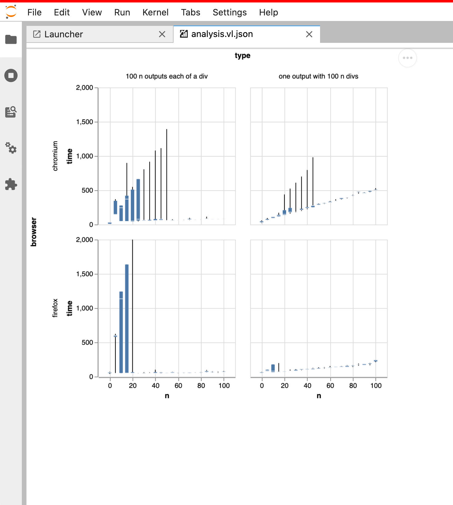

# Benchmarks

This package contains some scripts to run benchmarks against JupyterLab.

Currently it runs one type benchmark, switching between open notebooks, with a variety
of different notebook sizes and types.

To run the benchmarks against notebooks with long outputs and notebooks with many outputs, and to see how the times change as the notebooks grow:

```bash
# First install dependencies.
jlpm
```

```bash
# Run a benchmark passing 2 notebooks that will be opened and switched between.
env 'BENCHMARK_NOTEBOOKS=["./longOutput", "./manyOutputs"]' jlpm all
```



`BENCHMARK_NOTEBOOKS` should be a list strings that node can import that return a description of how to create a notebook.

They should have a default export of the type `NotebookType` in [`./src/notebookType.ts`](./src/notebookType.ts).

If you don't provide it, it will be run against all built in benchmark, which require installing some extensions below. It will keep increasing the `n` until either it reaches a maximum or the time exceeds a certain budget. It will run on both firefox and chrome.

The available notebook definitions are located in the `./src/notebooks` folder (some of those like the `plotly` and the `fixed-data-tables` need specific configuration as details in the next section to activate the extension):

- [`./src/notebooks/errorOutputs.ts`](./src/notebooks/errorOutputs.ts).
- [`./src/notebooks/fixedDataTable.ts](./src/notebooks/fixedDataTable.ts).
- [`./src/notebooks/largePlotly.ts](./src/notebooks/largePlotly.ts).
- [`./src/notebooks/longOutput.ts](./src/notebooks/longOutput.ts).
- [`./src/notebooks/manyCells.ts](./src/notebooks/manyCells.ts).    
- [`./src/notebooks/manyOutputs.ts](./src/notebooks/manyOutputs.ts).
- [`./src/notebooks/manyPlotly.ts](./src/notebooks/manyPlotly.ts).

## Plotly

We also build in support to run this against some plotly ipywidgets, to get a sense of
how rendering time is impacted by heavier mime render types:

First add the plotly and ipywidgets to the `dev_mode/package.json`:

```json
    "externalExtensions": {
      "@jupyter-widgets/jupyterlab-manager": "2.0.0",
      "plotlywidget": "1.5.4",
      "jupyterlab-plotly": "1.5.4"
    },
```

Then install the python packages:

```bash
pip install plotly==4.5.4 ipywidgets==7.5.1
```

Then run the build, run the benchmarks, and view the results:

```bash
env 'BENCHMARK_NOTEBOOKS=["./largePlotly", "./manyPlotly"]' jlpm all
```

## React Fixed Data Tables

We add support for testing against a mime render of [`fixed-data-table-2`](https://github.com/schrodinger/fixed-data-table-2) which
is an example of a cell output that takes a while to render:

```json
    "externalExtensions": {
      "fdtmime": "file:../benchmarks/extensions/fixed-data-table"
    },
```

```bash
env 'BENCHMARK_NOTEBOOKS=["./fixedDataTable", "./manyOutputs"]' jlpm all
```

## Comparing Benchmarks

We also support comparing two runs of benchmarks to give a sense of the relative changes. This is meant to answer the question "How much did these code changes affect
the time it takes to open a notebook?"

To do this, it uses the technique from Tomas Kalibera and Richard Jones in their paper
["Quantifying Performance Changes with Effect Size Confidence Intervals."](https://www.google.com/url?sa=t&rct=j&q=&esrc=s&source=web&cd=&cad=rja&uact=8&ved=2ahUKEwjEq7u9ovXqAhXYs54KHf3QCM0QFjACegQIBRAB&url=https%3A%2F%2Farxiv.org%2Fabs%2F2007.10899&usg=AOvVaw0ihkJJIaT6v95zlAtGtI2o) From their abstract:

> Inspired by statistical methods used in other fields of science, and building on results in statistics that did not make it to introductory textbooks, we present a statistical model that allows us both to quantify uncertainty in the ratio of (execution time) means and to design experiments with a rigorous treatment of those multiple sources of non-determinism that might impact measured performance. Better still, under our framework summaries can be as simple as “system A is faster than system B by 5.5% ± 2.5%, with 95% confidence”, a more natural statement than those derived from typical current practice, which are often misinterpreted.

```bash
# Create `old.csv` and `new.csv` files
env 'BENCHMARK_NOTEBOOKS=["./manyOutputs", "./longOutput"]' BENCHMARK_OUTPUT=old.csv jlpm start:benchmark
env 'BENCHMARK_NOTEBOOKS=["./manyOutputs", "./longOutput"]' BENCHMARK_OUTPUT=new.csv jlpm start:benchmark
# Create comparison csv file
jlpm run start:compare
# Create and open graph to view results
jlpm run start:compare-graph
```

When creating the comparison file, it will also print out a textual form of the analysis, like this:

```bash
$ node lib/compare.js
Writing output to diff.csv
Parsing data { path: 'old.csv', version: 'old' }
Parsing data { path: 'old.csv', version: 'new_' }
In firefox opening a notebook with 100 n outputs each of a div where n=0 is between 36.4% slower and 26.7% faster with 95% confidence.
In firefox opening a notebook with one output with 100 n divs where n=0 is between 1615.4% slower and 94.2% faster with 95% confidence.
...
✨  Done in 1.08s.
```

That's the same information as in the graph, but expressed as English.
