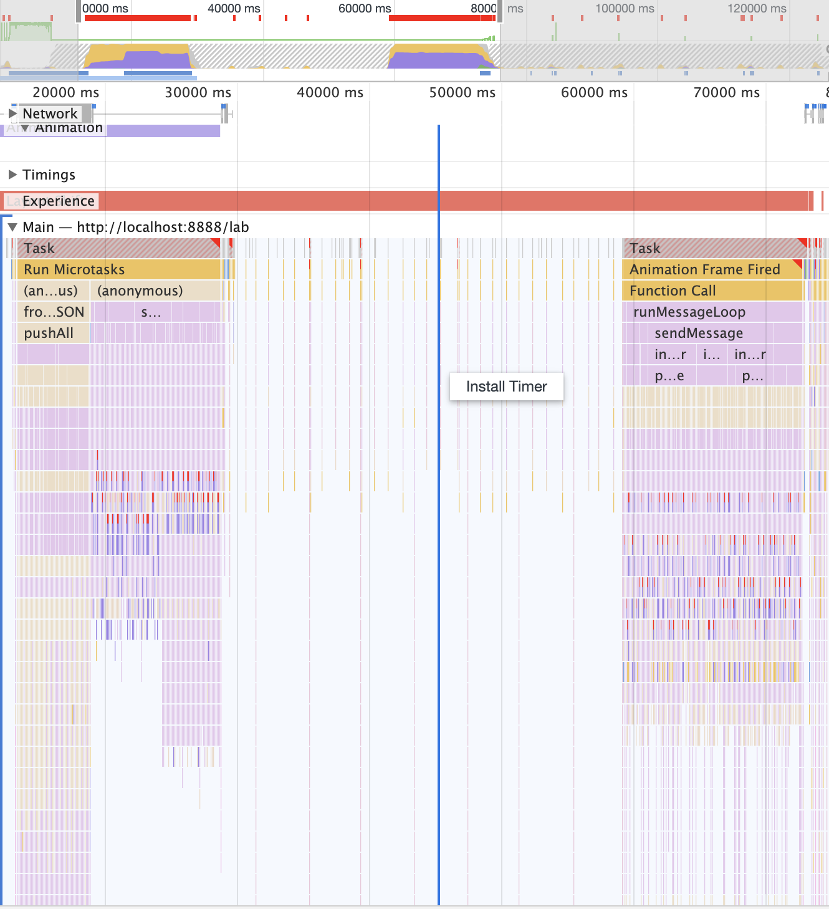

# Fixes

We can identify differents stategies for the fixes.

1. Strategy 1: Strip Output
1. Strategy 2: Adhoc Fix
1. Strategy 3: Virtualized Rendering
1. Strategy 4: DOM Optimization
1. Strategy 5: Web Workers
1. Strategy 6: Others

Whatever the fix, we want to ensure:

- `Search` functionality is still working like before

## Strategy 1: Strip Outputt

We could strip the cell output if too the ouput is too large.

However, tthis does not work for graphical outputs and does not provide any fix for the code editor which is the largest identified performance offender so far.

## Strategy 2: Adhoc Fix

We can think to adhoc fixes.

One way to get adhoc fix would be to further look at `updateEditorOnShow` implemented in [jupyterlab/jupyterlab#5700](https://github.com/jupyterlab/jupyterlab/issues/5700), but [is is already set to false...](https://github.com/jupyterlab/jupyterlab/blob/71f07379b184d5b0b8b67b55163d27194a61a0ac/packages/notebook/src/widget.ts#L493).

Other adhoc fix to optimize some code sections.

### Adhoc Fix Attempt 1 - Use requestAnimationFrame (non concluding)

Wrapped the cell creation into a requestAnimationFrame call. This produces a different profile pattern (2 heavy sections separated by an inactive one). The Forced layout due to codemirror are still there.



```javascript
requestAnimationFrame(() => {
    const cellDB = this._factory.modelDB!;
    const cellType = cellDB.createValue(id + '.type');
    let cell: ICellModel;
    switch (cellType.get()) {
        case 'code':
        cell = this._factory.createCodeCell({ id: id });
        break;
        case 'markdown':
        cell = this._factory.createMarkdownCell({ id: id });
        break;
        default:
        cell = this._factory.createRawCell({ id: id });
        break;
    }
    this._cellMap.set(id, cell);
});
```

### Adhoc Fix Attempt 2 - Use pushAll cells (non concluding)

We have updated the [celllist#pushAll](https://github.com/jupyterlab/jupyterlab/blob/7d1e17381d3ed61c23c189822810e8b4918d57ba/packages/notebook/src/celllist.ts#L333-L341) code block but it has not brought better performance.

Current attempts have not brought enhancements.

## Strategy 3: Virtualized Rendering

Cocalc has been [using react-virtualized](https://github.com/sagemathinc/cocalc/pull/3969).

We should look at this to understand how this could help.

Virtualization complexity and potential side-effects (search...) have to be taken into account.

### Intersection Observer

We can think to more generic fixes like using [Intersection Observer API](https://developer.mozilla.org/en-US/docs/Web/API/Intersection_Observer_API).

Useful links.

- [Intersection Observer API - Timing](https://developer.mozilla.org/en-US/docs/Web/API/Intersection_Observer_API/Timing_element_visibility)  
- [React Intersection Observer](https://github.com/thebuilder/react-intersection-observer)  
- https://react-intersection-observer.now.sh  

- https://webdesign.tutsplus.com/tutorials/how-to-intersection-observer--cms-30250
- https://css-tricks.com/a-few-functional-uses-for-intersection-observer-to-know-when-an-element-is-in-view

The strategy would be:

- Use an intersection observer to only render cells (input + output) on screen on page load.
- As there are free cycles, render the rest of the notebook.
- Ideally do this from the closest cell to the furthest.
- If any cell is in view, it loads.
- All non-loaded cells will need a cheap div that takes approx the same amount of space and has clear loading text.
- Add UI elements to indicate a notebook is still loading so that users don't search and not find something on the page.
- Do not load any notebook that is not visible (i.e. when you open a workspace and have notebooks that are not visible, they should not be rendered).

### React Virtualized / Windowing

An preliminary step is to wrap Notebook into React (see this PR [Try Notebok React component](https://github.com/jupyterlab/benchmarks/issues/15).

Then we could use React virtualisation libraries.

- [Creating More Efficient React Views with Windowing - ForwardJS San Francisco](https://www.youtube.com/watch?v=t4tuhg7b50I)  
- [Rendering large lists with React Virtualized](https://www.youtube.com/watch?v=UrgfPjX97Yg)  
- [React Virtualized](https://github.com/bvaughn/react-virtualized)  
- [React Window](https://github.com/bvaughn/react-window)  
- [Rendering large lists with react-virtualized or react-window](https://www.youtube.com/watch?v=QhPn6hLGljU)  
- https://addyosmani.com/blog/react-window  
- https://github.com/falinsky/tmdb-viewer (react-virtualized) https://tmdb-viewer.surge.sh  
- https://github.com/giovanni0918/tmdb-viewer (react-window)  
- [React Virtual](https://github.com/tannerlinsley/react-virtual)  

## Strategy 4: DOM Optimization

DOM optimization backed by libraries or new browser features

### Shadow DOM

- [Shadow DOM](https://developer.mozilla.org/en-US/docs/Web/Web_Components/Using_shadow_DOM)  

Initial Shadow DOM usage is implemented in [Move CodeMirror HTML tree and related CSS to shadow DOM](https://github.com/jupyterlab/jupyterlab/pull/8584).

```
- f7b7ee7d271bd1233a5b95c9fd9dfb2d9509bbe6
  - Move CodeMirror HTML tree and related CSS to shadow DOM
  - Sun Jul 26 05:33:10 2020 -0500
- 1f15fcbc577517f1f320252bbe0a7b5a48f32996
  - Merge pull request #8642 from saulshanabrook/2.2-changelog
  - Fri Jul 24 16:14:11 2020 -0400
```

We compare `f7b7ee7` vs `1f15fcb` and find that Shadow DOM made switching notebooks slightly faster in Chrome and slightly slower in Firefox.


### Content Visibility

We should try the upcoming [content visibility](https://web.dev/content-visibility) (supported in Chromium 85).

### Fast DOM

- https://github.com/wilsonpage/fastdom
 
## Strategy 5: Web Workers

- [Web Workers API](https://developer.mozilla.org/en-US/docs/Web/API/Web_Workers_API)  
- [Service Workers](https://developers.google.com/web/fundamentals/primers/service-workers)  
- [React and Webworkers](https://github.com/facebook/react/issues/3092#issuecomment-333417970)  

## Strategy 6: Others

### Display Locking

- [Display Locking](https://github.com/wicg/display-locking)  

### React Concurrency

- [React Concurrency](https://reactjs.org/docs/concurrent-mode-intro.html#concurrency)  
