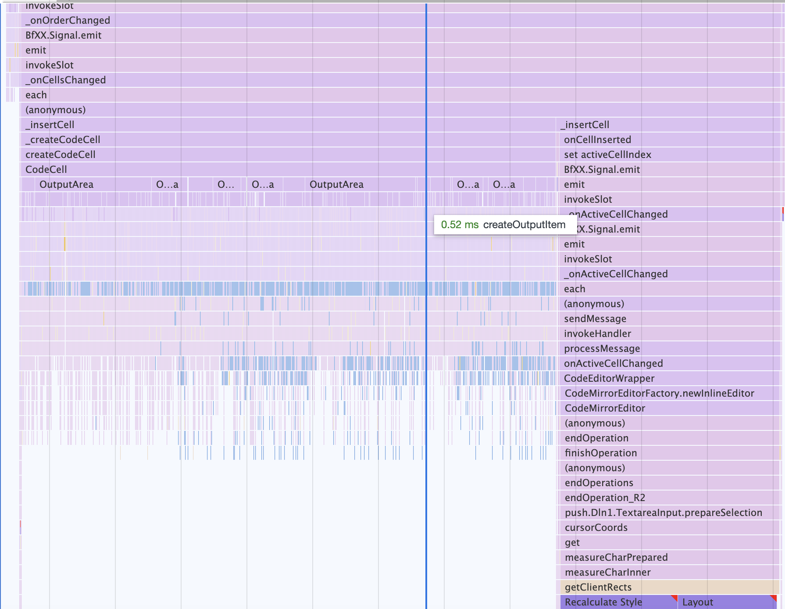
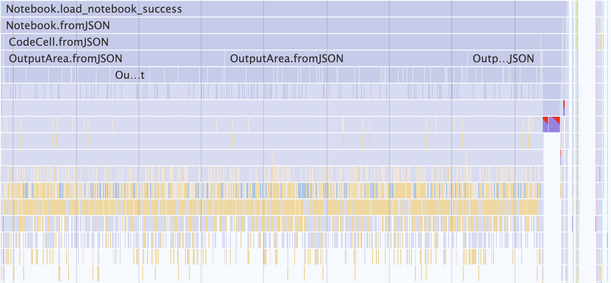

# Profiling

We invite you reading the [anatomy of a frame](https://aerotwist.com/blog/the-anatomy-of-a-frame/) to understand this figure (taken from a download of [this zip file](https://aerotwist.com/static/blog/the-anatomy-of-a-frame/anatomy-of-a-frame.zip)).

## TLDR

JupyterLab is hanging out / iterating at the Recalc style / Layout steps and does not produce the needed Tiles to be displayed. This happens when ["Any CSS property that changes an element's geometry, like its width, height, or position; the browser has to check all other elements and redo the layout.."](https://developers.google.com/web/tools/chrome-devtools/rendering-tools#layout).

From the many cells profiling, the Force layout is triggered in codemirror.

The single cell profiling does not highlight the code mirror issue: jupyterlab is nearly as performant as classic notebook as we test with only one cell editor.

## Open vs Switch Tab

The following analysis have been done when opening a notebook. When you switch to an already opened tab, the DOM is already populated and simple hidden with `lm-mod-hidden` and `p-mod-hidden` CSS classes. So when the browser needs to show it again, the cost preliminary steps are not run (so no Forced layout), and the cost is "just": "Recalc Style"->"Layout" all the way down to the Painting and Rasterizing without iteration

##  Many Cells - 2 LOC and 2 outputs per cell with 250 cells

> JupyterLab

`fromJSON` (10s) with iteration via pushAll on push->_onOrderChanged->onCellsChanged->each->_insertCell

`setOption` (10s) (`void Mode.ensure(mime).then(spec => { editor.setOption('mode', spec?.mime ?? 'null'); });`) with a lot of repetitive Forced reflow generated by codemirror.js (see next image).

`@lumino/messaging` `runMessageLoop` (13s), for which the initiator is at the very beginning (second 0), also with a lot of Forced reflow  (see next image).

> Classic Notebook

`Notebook.load_notebook_success `(19.2s) calling Notebook.fromJSON iterating on Notebook.insert_cell_at_index

There are some Forced reflow but less than in lab. They are triggered by codemirror (e.g. `removeChildrenAndAdd(display.measure, measureText); var height = measureText.offsetHeight / 50;`) (see next image).

Notebook is displayed and a few more quick actions are taken Notebook _session_started (0.3s)

> Comparison

NbClassic takes 20s to load the notebook and suffers from Forced reflow.

JupyterLab takes 33s to load and is more impacted by the Forced reflow than NbClassic is. Those Forced reflow are repetitive.

It sounds like most of the latency is due to codemirror triggering reflows. We should look how to typically solve this, see e.g. [CodeMirror/#/5873](https://github.com/codemirror/CodeMirror/issues/5873).

## Single Cell - 1 cell with many DIV outputs

> JupyterLab

`notebook.model.fromJson` (7s): A first action results appending the many div outputs without Forced layout (5s) followed by a Force layout in codemirror (2s) (in `measureCharInner`).

Style is Forced recalculated (1.72s) triggered by codemirror further to some lumino messages (note the 0.3s Update tree before and after this)

> Classic Notebook

`Notebook.load_notebook_success` (18s) calling `Notebook.fromJSON`->`OutputArea.fromJSON`.

Then 0.5s to recalculate the styles and layout.

PS: When profiling, classic notebook opens slower than without profiling, which can be understandable and is not an issue as we want to spot here the bottlenecks.

> Comparison

JupyterLab is here 20% slower than Classic Notebook.
